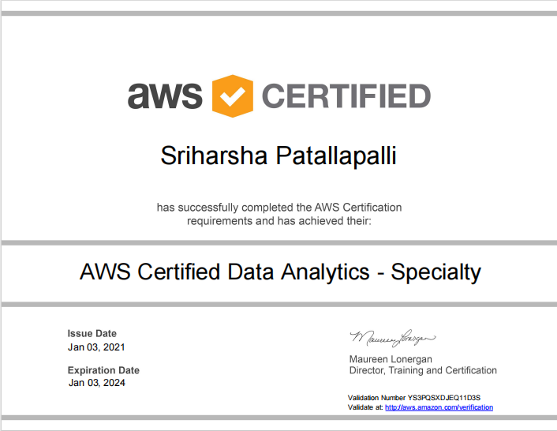
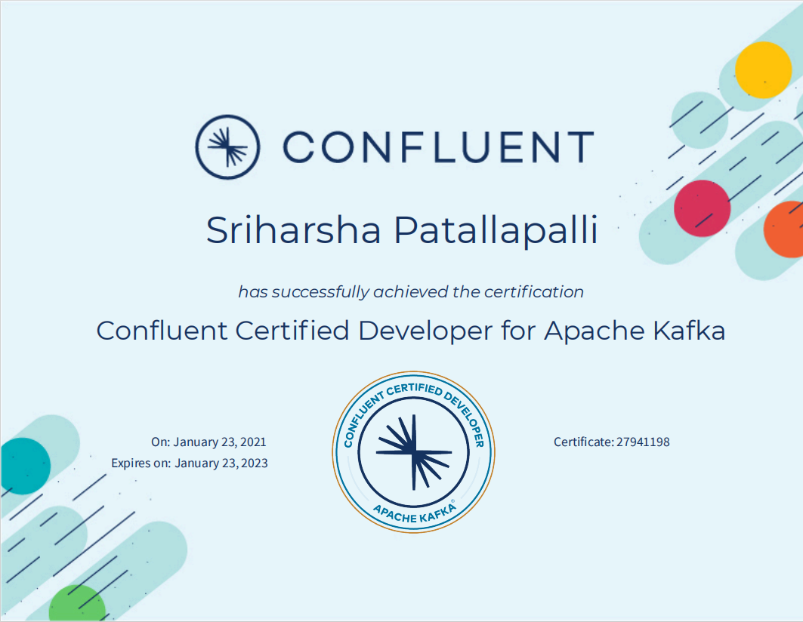
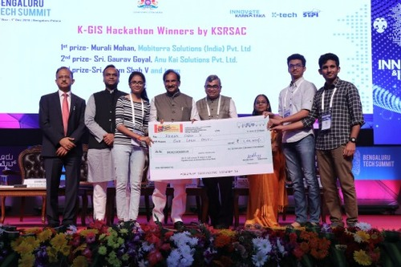

Special thanks for the beautiful design and functionality provided by the Hacker theme, developed by the GitHub Pages team. Here is the link to GitHub pages Hacker theme [Theme](https://github.com/pages-themes/hacker)..

# About me

Hello, I’m Sri Harsha, a results-driven AI enthusiast pursuing [Master’s in Artificial Intelligence](https://www.khoury.northeastern.edu/programs/artificial-intelligence-ms/) from Khoury College of Computer Sciences, [Northeastern University](https://graduate.northeastern.edu/), Boston. I bring a wealth of experience in building robust data pipelines and solutions for major companies like Lowe’s and GE Healthcare. Certified in AWS Data Analytics and Confluent Developer for Apache Kafka, I excel in leveraging cloud technologies to drive efficiency. My passion lies in tackling complex challenges, I'm open to collaboration, with no barriers to learning whatever's needed to solve the problem at hand.

# My precious certification

Achieved with great effort and unwavering dedication. While these certifications are expired, they are still precious.

[AWS Certified Data Analytics-Specialty](https://aws.amazon.com/certification/certified-data-analytics-specialty/)

[Confluent Certified Developer for Apache Kafka](https://www.confluent.io/certification/#get-certified)

# Hackathons and projects

Hackathons were one way I was acquainted with this dynamic world. The highly competitive environment where several innovative ideas are brought to fruition is what drew me to them. I found to my surprise, I was good at teamwork, handling the long hours and the pressure. With a team of three, I won or finished on the podium in multiple events. It was during these events, I gradually realized a pattern emerged, where predictive data analytics, artificial intelligence (AI), and machine learning (ML) seemed to be driving a lot of innovations and ideas. Our team’s winning solutions also usually revolved around these core concepts.

These are some of the problems we tried to solve. All of these are genuine problems we saw in world. When I say we, I mean my friends and I.

### K-GIS Hackathon, Bengaluru Tech Summit 2018

During the months of september and november 2018, I was part of team which competed in one of the prestigious hackathons of that time. We secured third position while the first two were given to startups. 

# Experience

### Lowe's

text

### GE Healthcare

text

### GE Power

text

### GE Digital

text

### Defence Research Development Organisation

# Education

### Northeastern University, Boston
Pursuing Master's in Artificial Intelligence at Khoury College of computer Science. Since Fall 2023. 

### Amrita School of Engineering
